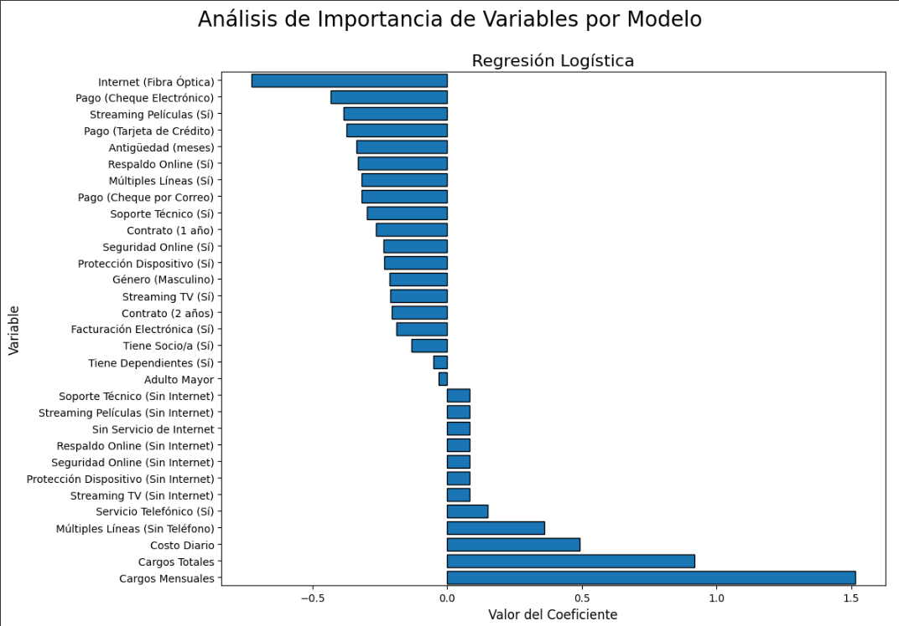
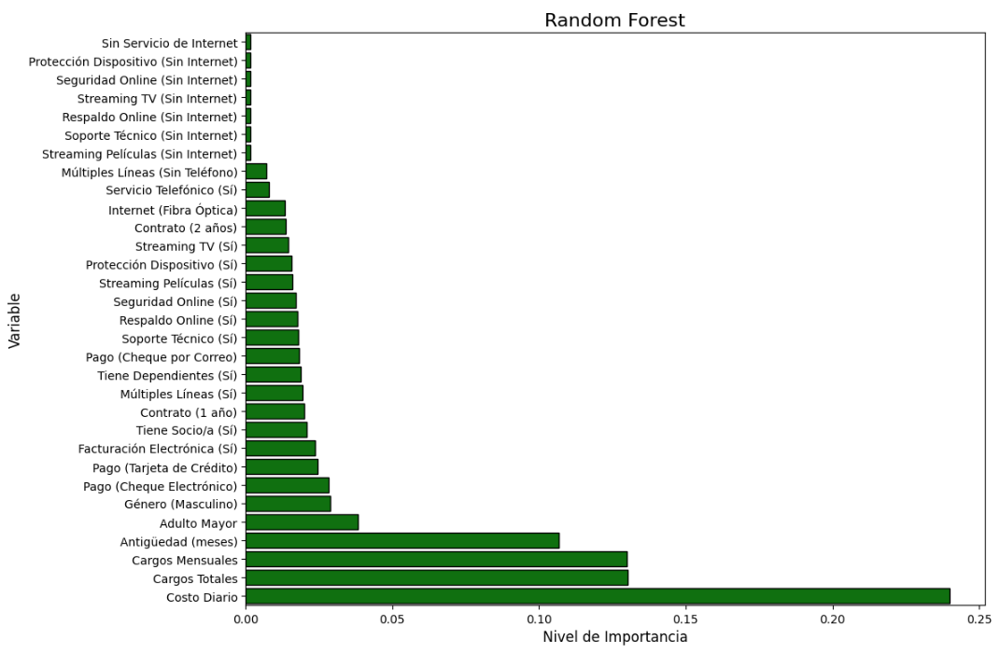
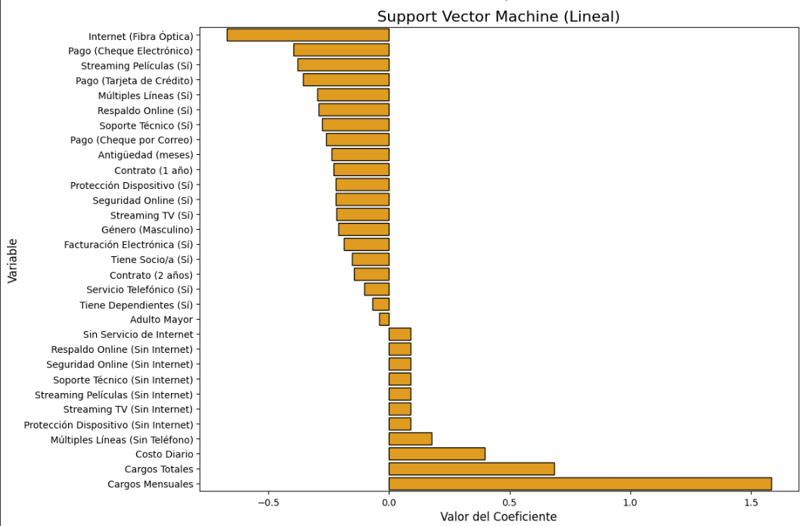
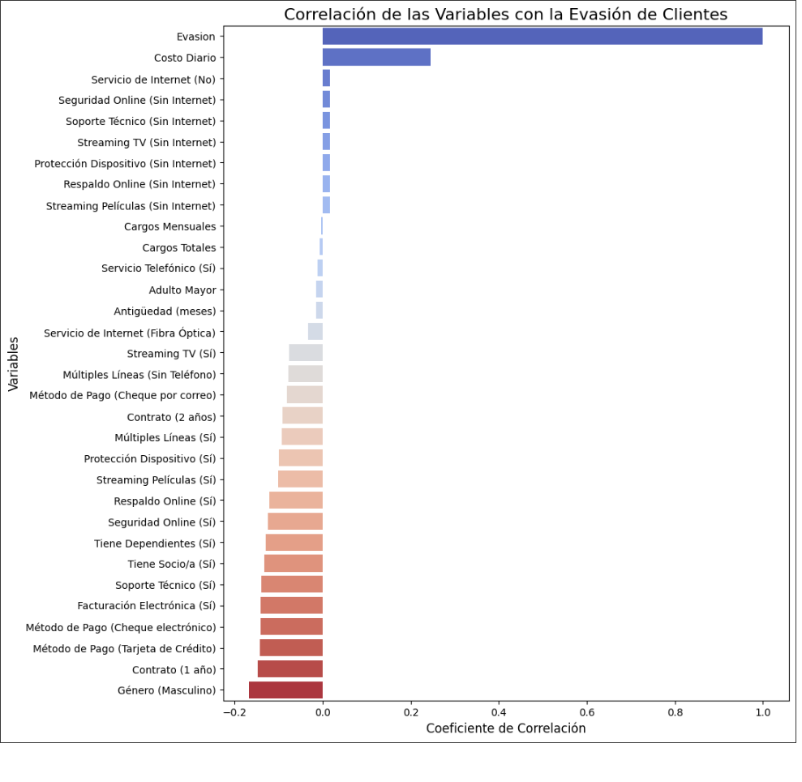
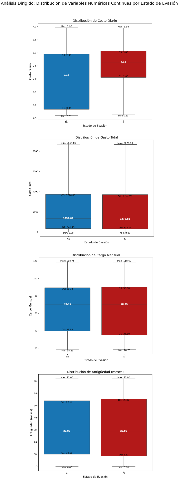
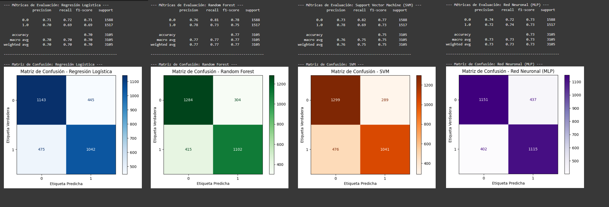
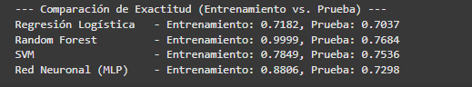

# README

# 📊 Proyecto de Análisis y Predicción de Evasión de Clientes (Churn) | Telecom X

Un proyecto integral de ciencia de datos que abarca desde el análisis exploratorio (EDA) hasta el entrenamiento y evaluación de modelos de Machine Learning para predecir la evasión de clientes en una empresa de telecomunicaciones.

---

### 👥 **Autor**

-   **Nombre:** Jose Toro Orellana
-   **Mail:** jose.toro.orellana@gmail.com
-   **GitHub:** [cotetin](https://github.com/cotetin)

---

### 📋 **Descripción del Proyecto**

Este proyecto, contenido en el notebook `TelecomX_LATAM_2.ipynb`, aborda el problema de la evasión de clientes (churn) desde dos frentes:

1.  **Análisis Exploratorio de Datos (EDA):** Se realiza un análisis detallado de datos de clientes para extraer insights sobre el perfil demográfico y de consumo de los clientes que cancelan el servicio, la influencia del tipo de contrato, los métodos de pago y el impacto de los servicios adicionales.
2.  **Modelado Predictivo (Machine Learning):** Se entrenan, evalúan y comparan cuatro modelos de clasificación (Regresión Logística, Random Forest, SVM y Red Neuronal) para predecir con precisión qué clientes tienen una alta probabilidad de abandonar la empresa.

El objetivo final es proporcionar a la empresa una herramienta de análisis y un modelo predictivo que permitan diseñar estrategias de retención efectivas y basadas en datos.

---

### ⚙️ **Análisis y Modelado Realizado**

-   **Carga y Limpieza:** Extracción de datos desde una API en formato JSON, manejo de inconsistencias y valores nulos.
-   **Ingeniería de Características:** Creación de nuevas variables (`Costo_Diario`), estandarización de variables categóricas (`Churn` a formato binario).
-   **Análisis Exploratorio (EDA):**
    -   Análisis descriptivo y de distribución de variables.
    -   Visualización de la tasa de evasión por grupos (género, tipo de contrato, método de pago).
    -   Análisis de correlación entre variables numéricas.
-   **Preprocesamiento para ML:**
    -   Codificación de variables categóricas mediante One-Hot Encoding.
    -   División de datos en conjuntos de entrenamiento y prueba.
-   **Entrenamiento y Evaluación de Modelos:**
    -   Implementación de Regresión Logística, Random Forest, SVM y Red Neuronal (MLP).
    -   Evaluación de rendimiento con métricas como `Accuracy`, `Precision`, `Recall` y `F1-Score`.
    -   Generación y análisis de Matrices de Confusión.
-   **Análisis de Importancia de Variables:** Identificación de los factores más influyentes en la predicción de cada modelo.

---

### 🛠️ **Tecnologías Utilizadas**

-   **Lenguaje:** Python 3
-   **Bibliotecas Principales:**
    -   `Pandas`: Manipulación y análisis de datos.
    -   `Matplotlib` & `Seaborn`: Visualización de datos.
    -   `Scikit-learn`: Implementación de modelos de Machine Learning y preprocesamiento.
-   **Entorno:** Google Colab / Jupyter Notebook

---

### 📦 **Guía de Ejecución**

1.  **Entorno:** Este notebook está diseñado para ejecutarse preferiblemente en **Google Colab**.
2.  **Librerías:** Todas las librerías necesarias (`pandas`, `matplotlib`, `seaborn`, `sklearn`) suelen estar preinstaladas en Google Colab.
3.  **Abrir Notebook:** Sube o abre el archivo `TelecomX_LATAM_2.ipynb` en tu entorno de Google Colab.
4.  **Ejecutar Celdas:** Ejecuta todas las celdas en orden secuencial (de arriba hacia abajo). Es crucial ejecutar las secciones de **Extracción, Limpieza y Preprocesamiento** antes de las secciones de **Análisis y Modelado** para asegurar que los DataFrames estén correctamente definidos.

---

### 💻 **Cómo Utilizar**

-   Ejecuta el notebook celda por celda para replicar el análisis y el entrenamiento de los modelos.
-   Observa los gráficos y las tablas de métricas para comprender los factores que impulsan la evasión y el rendimiento de cada modelo.
-   Presta especial atención a las secciones de **Análisis de Importancia de Variables** y al **Informe Final** para entender las conclusiones y recomendaciones estratégicas.
-   ¡Siéntete libre de experimentar! Puedes modificar los hiperparámetros de los modelos o probar diferentes visualizaciones para profundizar aún más en el análisis.

### 🎨 **Vista Previa**

### **Breve resumen de los hallazgos de la evaluación y Código para el Análisis de Importancia de Variables**

Basado en las métricas de la etapa anterior, el modelo Random Forest demostró el mejor rendimiento predictivo en los datos de prueba (mayor F1-Score y Recall), a pesar de mostrar signos de overfitting. La Regresión Logística y el SVM mostraron un rendimiento sólido y buena generalización. La Red Neuronal tuvo un desempeño intermedio.

### **Regresión Logística**

---

### **Random Forest**

---

### **Support Vector Machine (Lineal)**

---

### **Red Neuronal (Permutation Importance)**

### **Interpretación de los Gráficos Resultantes**

Al ejecutar este código, obtendrás cuatro gráficos. Esto es lo que debes observar:

#### **Regresión Logística y SVM Lineal:**

Estos modelos son lineales, lo que permite una interpretación directa de los coeficientes de cada variable.

-  Barras a la derecha (positivas): Son las variables que más aumentan la probabilidad de cancelación. Los resultados del análisis muestran que características como tener Fibra Óptica o pagar con Cheque Electrónico son fuertes impulsores de la evasión.

-  Barras a la izquierda (negativas): Son las variables que más disminuyen la probabilidad de cancelación (es decir, que fomentan la retención). Como era de esperar, la antigüedad (tenure) y los contratos a largo plazo (1 o 2 años) son los factores de retención más importantes.

#### **Explicación del Eje X (Valor del Coeficiente)**

El eje X en estos dos gráficos representa el valor del coeficiente que el modelo le asigna a cada variable. Este valor nos dice dos cosas:

1. *La Dirección del Impacto (el signo +/-):*

-  Un coeficiente positivo significa que la variable está directamente relacionada con la cancelación. A medida que el valor de esa variable aumenta, la probabilidad de que el cliente cancele (Evasion = 1) también aumenta.

-  Un coeficiente negativo significa que la variable está inversamente relacionada con la cancelación. A medida que el valor de esa variable aumenta (por ejemplo, más meses de antigüedad), la probabilidad de que el cliente cancele disminuye.

2. *La Fuerza del Impacto (la magnitud):*

-  El tamaño de la barra (o el valor absoluto del coeficiente) indica qué tan fuerte es ese impacto. Una barra larga (ya sea positiva o negativa) representa una variable que tiene una gran influencia en la predicción del modelo.

#### **Random Forest y Red Neuronal (Permutation Importance):**

Estos modelos son más complejos y no tienen coeficientes directos, por lo que su importancia se mide de otra forma.

-  En estos gráficos, todas las barras serán positivas. La longitud de la barra indica la importancia general de la variable para el modelo, sin importar si el efecto es positivo o negativo.

-  Los resultados muestran que las variables más largas coinciden en gran medida con los extremos de los gráficos anteriores. Variables como la antigüedad, los cargos mensuales y el tipo de contrato son consistentemente las más destacadas, confirmando su alta relevancia.

#### **Explicación del Eje X (Nivel de Importancia)**

El eje X en estos dos gráficos representa el poder predictivo general de cada variable. A diferencia de los coeficientes, estos valores siempre son positivos y se interpretan así:

1. *Random Forest (Nivel de Importancia):*

-  El eje X muestra cuánto contribuye cada variable a la "pureza" de las decisiones dentro de los árboles que componen el bosque. Una barra más larga significa que el modelo depende más de esa variable para clasificar correctamente a los clientes entre los que cancelan y los que no.

2. *Red Neuronal (Caída en el Rendimiento):*

-  En este caso, el eje X muestra cuánto empeora el rendimiento del modelo si se le quita la información de esa variable (desordenándola aleatoriamente). Una barra larga significa que la variable es muy importante, porque sin ella, el modelo pierde mucha de su capacidad predictiva.

-  En ambos casos, una barra más larga significa que la variable es más fundamental para las predicciones del modelo.

# Conclusión

## Informe Detallado de Factores de Cancelación

Basado en el análisis de los datos de **TelecomX_LATAM_2**, hemos identificado varias variables clave que influyen significativamente en la tasa de cancelación de clientes (churn). A continuación, se presenta un informe detallado basado en los hallazgos de los modelos y análisis visuales.

### **Resultados y Visualizaciones Clave**

#### 1. Análisis Exploratorio

---

#### 2. Resultados de los Modelos (Matrices de Confusión)

---

#### 3. Comparación de Rendimiento y Análisis de Variables

### 1. Variables Categóricas

-   **Tipo de Contrato (Contract)**: Esta es una de las variables más influyentes. Los clientes con **contratos "Mes a Mes"** muestran una tasa de evasión considerablemente más alta en comparación con aquellos con contratos de "Un Año" o "Dos Años". Esto sugiere que los clientes con compromisos a corto plazo son menos leales y más propensos a cancelar el servicio.
-   **Método de Pago (PaymentMethod)**: El método de pago también revela patrones importantes. Los clientes que utilizan **"Cheque Electrónico"** tienen la tasa de cancelación más alta. Esto podría indicar problemas en el proceso de pago, falta de automatización o que este segmento de clientes es inherentemente menos estable.
-   **Género (gender)**: El análisis por género no mostró una diferencia significativa en la tasa de evasión, lo que indica que no es un factor determinante en la cancelación del servicio.

### 2. Variables Numéricas

-   **Antigüedad (tenure)**: Existe una fuerte correlación negativa entre la antigüedad del cliente y la evasión. Los **clientes nuevos (con baja antigüedad)** son mucho más propensos a cancelar. La tasa de churn disminuye drásticamente a medida que el cliente permanece más tiempo con la empresa, estabilizándose después de los primeros meses.
-   **Cargos Mensuales y Diarios (Charges.Monthly / Costo_Diario)**: Se observa una correlación positiva entre los cargos mensuales/diarios y la evasión. Los clientes que pagan **tarifas mensuales más altas** tienden a cancelar más. Esto es especialmente notorio en clientes con servicios de mayor costo, como la fibra óptica.
-   **Cantidad de Servicios Contratados**: La relación no es lineal, pero se identificó que los clientes con **muy pocos servicios (1-2)** o con una **gran cantidad de servicios (aproximadamente 7)** tienen tasas de evasión más altas. Esto podría deberse a que los clientes con pocos servicios no perciben suficiente valor, mientras que aquellos con muchos servicios pueden sentirse abrumados por el costo total.

---

## Principales Factores de Cancelación y Estrategias de Retención

A partir del informe anterior, los principales factores que impulsan la cancelación de clientes son el **tipo de contrato a corto plazo**, la **baja antigüedad** y los **altos cargos mensuales**.

A continuación, se proponen estrategias de retención específicas para abordar cada uno de estos factores.

### Estrategias de Retención Propuestas

#### **1. Optimizar la Estrategia de Contratos**

* **Factor Principal**: La alta tasa de evasión en clientes con contratos **"Mes a Mes"**.
* **Estrategias Propuestas**:
    * **Incentivos para Contratos a Largo Plazo**: Lanzar campañas de marketing dirigidas a los clientes de "Mes a Mes" ofreciendo descuentos atractivos, servicios adicionales gratuitos o beneficios de lealtad si migran a contratos de uno o dos años.
    * **Programas de Lealtad**: Implementar un programa de recompensas que beneficie a los clientes por su permanencia, especialmente después de superar los hitos críticos de los primeros meses.

#### **2. Mejorar la Experiencia del Cliente Nuevo**

* **Factor Principal**: La alta propensión a la cancelación de **clientes nuevos (baja antigüedad)**.
* **Estrategias Propuestas**:
    * **Onboarding Proactivo**: Crear un programa de onboarding robusto para los primeros 90 días, que incluya seguimiento personalizado, tutoriales sobre los servicios contratados y una oferta de bienvenida especial para asegurar una experiencia inicial positiva.
    * **Soporte Técnico Prioritario**: Ofrecer un canal de soporte técnico prioritario para clientes nuevos para resolver rápidamente cualquier problema técnico que pueda causar frustración y cancelación temprana.

#### **3. Revisar la Estructura de Precios y Pagos**

* **Factor Principal**: La evasión en clientes con **cargos mensuales elevados** y aquellos que pagan con **cheque electrónico**.
* **Estrategias Propuestas**:
    * **Paquetes Personalizados**: Utilizar el análisis de datos para ofrecer paquetes de servicios personalizados y flexibles que se ajusten mejor al presupuesto y a las necesidades del cliente, evitando cargos mensuales excesivos.
    * **Fomentar Pagos Automáticos**: Incentivar el uso de métodos de pago automáticos (transferencia bancaria, tarjeta de crédito) mediante pequeños descuentos o beneficios. Esto no solo reduce la probabilidad de problemas de pago, sino que también aumenta la "adherencia" del cliente al servicio.
    * **Análisis de Valor**: Para los clientes con muchos servicios, comunicar proactivamente el valor que están recibiendo y ofrecer revisiones de cuenta para asegurar que están en el plan más rentable
